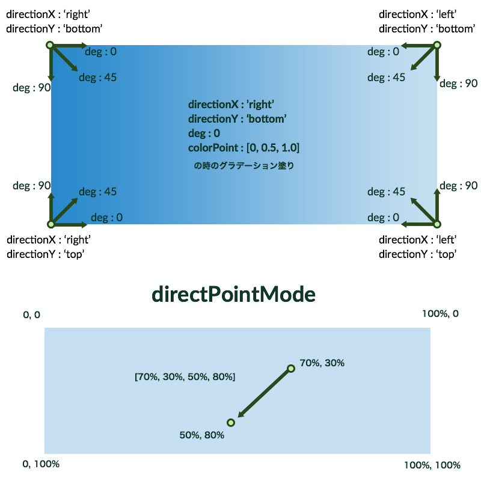
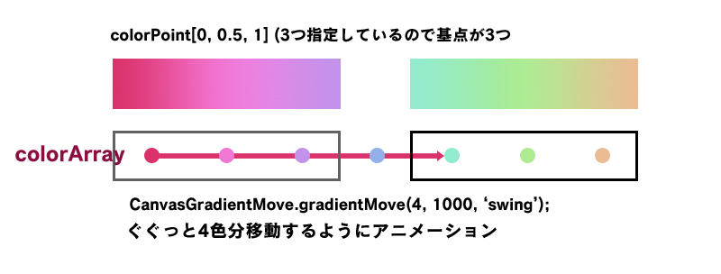

#CanvasGradientMove

##概要

canvasを用いてグラデーションを描画し、アニメーションさせるjQueryプラグインです。  
css3のどうしようもなく重いグラデーション描画をcanvasで代用することで軽くて滑らかなグラデーションアニメーションを実現しました。  
jQueryのanimateを使用しているため、[jQuery Easing Plugin](http://gsgd.co.uk/sandbox/jquery/easing/)と併用することでイージングの種類を大幅に増やすことができます。

##UPDATE

- **2015.02.06** 配布用に調整、サンプル追加

##記述

第一引数でオプションを設定します。

###例

	var targetCanvas_01 = $('#canvas-gradient-parent');
	targetCanvas_01.CanvasGradientMove({
		colorArray: [
			'#FFFFFF','#FFFFFF','#FFFFFF',
			'#e4d874',
			'#41431f','#6d7039','#646a00'
		],
		colorPoint: [0,0.5,1],
		firstScene: 0,
		directionX: 'right',
		directionY: 'bottom',
		deg: 45,
		directPointMode: null,
		maskImg: false,
		liquid: true
	});
	var CanvasGradientMove = targetCanvas_01.data('CanvasGradientMove');
	

- **colorArray**：グラデーションに使用する色の配列です。firstSceneを指定しない限り、一番最初から描画に使用されます。
- **colorPoint**：グラデーションのカラー基点を0〜1で指定します。例の場合だと0%,50%,100%でグラデーションの基点が指定されます。指定する数を調整することでグラデーションの色の変化数を調整できます。
- **firstScene**：最初に描画されるグラデーションの1番目の色を配列のindexで指定します。デフォルトは0です。
- **directionX**：グラデーションの方向（左右）を指定します。`left`か`right`のみ指定可能です。
- **directionY**：グラデーションの方向（上下）を指定します。`top`か`bottom`のみ指定可能です。
- **deg**：グラデーションの角度を指定します。0〜90の値が指定可能です。
- **directPointMode**：グラデーションの始点と終点の位置を`%`と`px`で指定できます。`directPointMode`を使用する際、`directionX`と`directionY`と`deg`の指定は無効になります。配列で`[始点X座標, 始点Y座標, 終点X座標, 終点Y座標]`を渡す必要があります。配列の値は`'10px'`や`'10%'`のようにStringで渡す必要があります。
- **maskImg**：グラデーションにマスクをかけたい場合、黒地に透明でマスク部分をくり抜いた画像を指定します。この時、ロード済みのImageを指定する必要があります。マスク時は自動的にcanvasのサイズで描かれるので、canvasまたはparentとなる要素のサイズを指定すると拡縮を防ぐことができます。（Sampleの2を参照）
- **liquid**：生成されたcanvasが包括する親要素に合わせてリサイズするかを指定できます。

##メソッド

###上記の記述例に合わせた形で書いています。

####init

	CanvasGradientMove.init();

canvasの生成・グラデーションの初期描画・リサイズ設定を行います。

####gradientMove

	CanvasGradientMove.gradientMove(skipFrame, duration, easing, callback);   

グラデーションのアニメーションを開始します。

- **skipFrame** - type: Number  
フレームの移動量を指定します。負または正の整数を指定可能です。
- **duration** - type: Number(ms)  
フレームの移動にかかる時間を設定します。
- **easing** - type: String  
easingの種類を指定します。jQueryのanimateを使用しているため、通常は`'linear'`と`'swing'`のみですが、[jQuery Easing Plugin](http://gsgd.co.uk/sandbox/jquery/easing/)と併用することでイージングの種類を大幅に増やすことができます。デフォルトは`'swing'`です。
- **callback** - type: Function  
アニメーション後のコールバックを指定します。

####moveFrame

	CanvasGradientMove.moveFrame(skipFrame");

カラーの位置を変更します。負の整数を指定すると戻り、正の整数を指定すると進みます。位置を変更するのみなので、色に反映するには`gradientMove`または`canvasDrawGradient`を走らせる必要があります。

- **skipFrame** - type: Number  
フレームの移動量を指定します。負または正の整数を指定可能です。

####canvasDrawGradient

	CanvasGradientMove.canvasDrawGradient();

グラデーションを再描画します。

####canvasClear

	CanvasGradientMove.canvasClear();

canvasを初期化します。

####liquidOn

	CanvasGradientMove.liquidOn();

canvasのリサイズイベントを有効にします。

####liquidOff

	CanvasGradientMove.liquidOff();

canvasのリサイズイベントを無効にします。